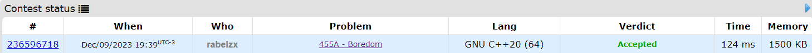
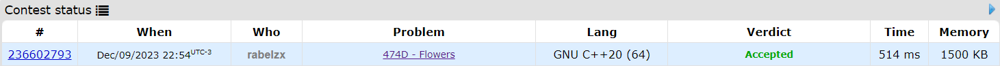

# Exercícios Online

**Conteúdo da Disciplina**: Programação Dinâmica  

## Alunos
|Matrícula | Aluno |
| -- | -- |
| 21/1030729  |  Eric Rabelo Borges |
| 19/0058455  |  Mariana Oliveira Pires do Rio |

## Sobre 

Este projeto abrange as soluções para exercícios de Juiz Online que demandam a aplicação de técnicas de programação dinâmica.
 
### Exercício 1:  [Boredom](https://codeforces.com/problemset/problem/455/A)

Alex tem uma sequência de inteiros e quer ganhar o máximo de pontos possível seguindo algumas regras. Em cada passo, ele pode escolher um número (ak), removê-lo, e também remover os números ak + 1 e ak - 1. A pontuação é igual ao número escolhido (ak). O desafio é determinar a pontuação máxima que Alex pode alcançar. 

Confira o enunciado do exercício [aqui](https://codeforces.com/problemset/problem/455/A)

- [Ir para solução](Solutions/Boredom.cpp)

### Exercício 2: [Flowers](https://codeforces.com/problemset/problem/474/D)

Marmot aprecia comer flores no jantar, seguindo a regra de preferir consumir flores brancas em grupos de tamanho k. O desafio é determinar quantas maneiras Marmot pode comer entre a e b flores para cada caso de teste, respeitando essa regra. Como o número de maneiras pode ser grande, a resposta deve ser impressa módulo 1000000007 (10^9 + 7).

Confira o enunciado do exercício [aqui](https://codeforces.com/problemset/problem/474/D)

- [Ir para solução](Solutions/Flowers.cpp)
### Exercício 3: [---](https://codeforces.com/problemset/problem/1285/D)

Confira o enunciado do exercício [aqui](https://codeforces.com/problemset/problem/1285/D)

- [Ir para solução](Solutions/Dr.EvilUnderscores.cpp)

### Exercício 4: [---](https://codeforces.com/contest/1385/problem/D)

Confira o enunciado do exercício [aqui](https://codeforces.com/contest/1385/problem/D)

- [Ir para solução](Solutions/a-GoodString.cpp)

## Screenshots

### Boredom

### Flowers

### ---

### ---

## Instalação 
Não é necessario instalação. As soluções podem ser submetidas nos sites: [Codeforces](https://codeforces.com/).

**Linguagem**: C++ 

## Apresentação
Assista o vídeo explicativo do projeto clicando [aqui](/Apresentação.mp4).  
*Observação: A apresentação está em formato .mp4, portanto, faça o download para assisti-la.*